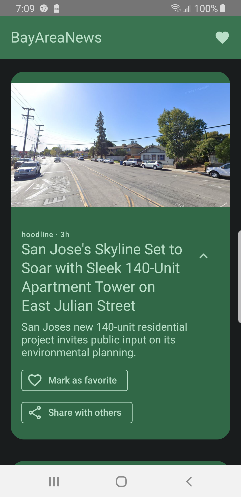
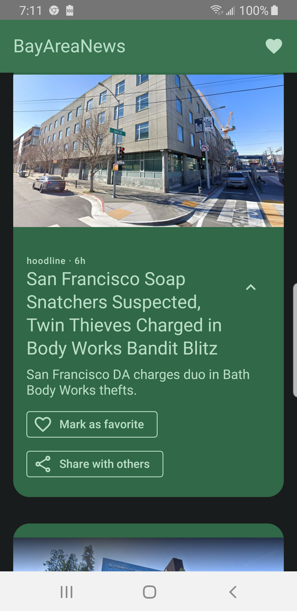
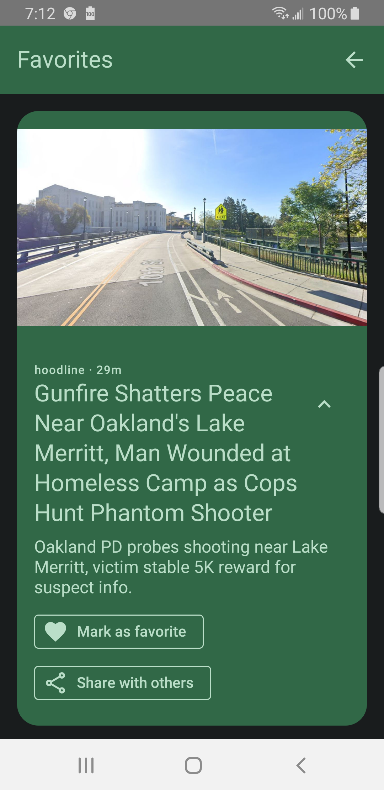

# BayAreaNews

<a href="https://play.google.com/store/apps/details?id=com.kk.android.bayareanews">Find on Google Play Store</a>

## Breaking Bay Area news feed, no ads, just the news.  Also can mark articles as Favorites so you can read later.

### Bay Area News app -- Written in Kotlin using Jetpack Compose, mvvm, flow coroutines, sqlite,
dagger/hilt dependency injection, RSS reader

